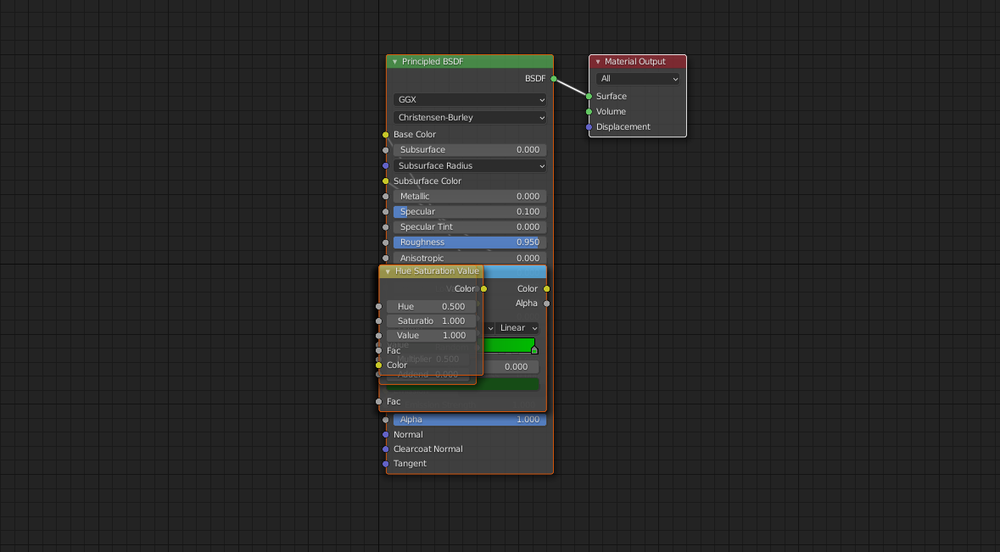
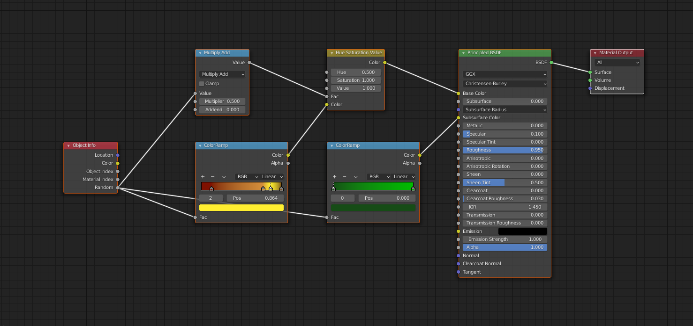

# Blender Shader Node Arranger

This script arranges the shader nodes of the current active material.
The nodes are all set to the (0, 0) position initially, then arranged right to left, from the output node based on inputs to each node as they are placed.

Example node placement from script adding nodes:

Nodes after scripted rearrangement:

Still to be done:
- Handle multiple output nodes
- Handle increased complexity of nodes
- Arrange to prevent crossing routing lines as much as possible
- Add rerouter nodes to prevent routing lines passing beneath nodes
